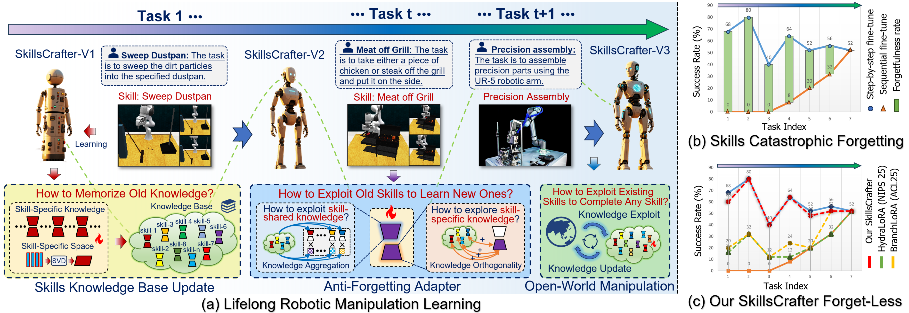

##   Lifelong Language-Conditioned Robotic Manipulation Learning

Traditional language-conditioned manipulation agent adaptation to new manipulation skills leads to catastrophic forgetting of old skills, limiting dynamic scene practical deployment. In this paper, we propose SkillsCrafter, a novel robotic manipulation framework designed to continually learn multiple skills while reducing catastrophic forgetting of old skills. Specifically, we propose a Manipulation Skills Adaptation to retain the old skills knowledge while inheriting the shared knowledge between new and old skills to facilitate learning of new skills. Meanwhile, we perform the singular value decomposition on the diverse skill instructions to obtain common skill semantic subspace projection matrices, thereby recording the essential semantic space of skills. To achieve forget-less and generalization manipulation, we propose a Skills Specialization Aggregation to compute inter-skills similarity in skill semantic subspaces, achieving aggregation of the previously learned skill knowledge for any new or unknown skill. Extensive simulator and real-world experiments demonstrate the effectiveness and superiority of our SkillsCrafter.
<p align="center">  </p>

***

### Installation
1. Clone this repository
```bash
git clone https://github.com/lifelong-SkillsCrafter/code
```

2. Simulation Environment Installation
```Shell
conda create -n crafter python=3.8.1 -y
cd SkillsCrafter/sim
git clone https://github.com/stepjam/PyRep.git
cd PyRep
pip install -r requirements.txt
pip install .
```
Add the following to your *~/.bashrc* file: (__NOTE__: the 'EDIT ME' in the first line)

```bash
export COPPELIASIM_ROOT=<EDIT ME>/PATH/TO/COPPELIASIM/INSTALL/DIR
export LD_LIBRARY_PATH=$LD_LIBRARY_PATH:$COPPELIASIM_ROOT
export QT_QPA_PLATFORM_PLUGIN_PATH=$COPPELIASIM_ROOT
```

```Shell
pip install -r requirements.txt
pip install .
```

3. Install additional packages for training cases
```
cd SkillsCrafter
pip install -e ".[train]"
pip install flash-attn --no-build-isolation
```
***

### Prepare Simulation Data
#### 1. Generate RLBench Demos
```angular2html
cd SkillsCrafter/sim/
bash data.sh
```

#### 2. Adapt the Format
We provide a script to make it easier to generate annotations.
```angular2html
cd /SkillsCrafter/sim
bash instruction_generate.sh
```
You will now see the file ``train.json`` in ``data/anns`` folder, which can further be used for vision-action instruction tuning.

```angular2html
SkillsCrafter/sim
│ 
└── data
│   ├── anns
│   │   ├── sweep_to_dustpan_of_size
│   └── val
│   │   └── (10 demos preciously generated)
│   │
│   └── sweep_to_dustpan_of_size 
│       └── (demos download by link)         
│
└── instruction_generate.sh
```
#### 3. SVD for Common Skill Semantic Subspaces
```shell
python data/task_name.py  # Obtain Task Instructions
python instruction_svd.py 
```
#### 4. Preparing a pre-trained LLARVA model
<table><tbody>
<!-- START TABLE -->
<!-- TABLE HEADER -->
<th valign="bottom">Model</th>
<th valign="bottom">Size</th>
<th valign="bottom">Train Set</th>
<th valign="bottom">Backbone</th>
<th valign="bottom">Download</th>
<!-- TABLE BODY -->
<!-- ROW: retinanet_R_50_FPN_1x -->
<tr><td align="left">LLARVA</td>
<td align="center">7B</td>
<td align="center"><a href="https://github.com/Dantong88/LLARVA/blob/main/docs/DATASET.md">OXE Vision-Action Instruction Pre-training Dataset</a></td>
<td align="center">Vicuna-7B</td>
<td align="center"><a href="https://drive.google.com/drive/folders/1BOWZn-jFdLLzutXWZmdit3cDv8qXezs8?usp=sharing">Model</a></td>
</tr>
</tbody></table>

***

### Instruction Tuning and Inference
#### 1. Put the Pre-training Model
Copy the pre-trained model to the output folder, for example:
```angular2html
cd SkillsCrafter/sim
mkdir output
cd output
mkdir llava-lora-instruction-tuning-sweep_to_dustpan_of_size
cp -r the/path/pretrained_model  llava-lora-instruction-tuning-sweep_to_dustpan_of_size
```
#### 2. Launch the instruction tuning.

```angular2html
cd SkillsCrafter/sim
bash task_train.sh
```
You will see the following structure：
```angular2html
SkillsCrafter/sim/task
│ 
└── task0
│   ├── task0_instruction.txt
│   └── skill_subspace.pt
│   └── task_lora.pt
│   │   
└── task1
│   ├── task1_instruction.txt
│   └── skill_subspace.pt  
│   └── task_lora.pt    
......
└── instruction_svd.py
```
#### 3. Inference

To test the model on RLBench, just run

```angular2html
cd SkillsCrafter/sim
export SIM_ROOT=SkillsCrafter/sim
python eval.py \
rlbench.demo_path=$SIM_ROOT/data/val \
framework.eval_from_eps_number=0 \
framework.eval_episodes=25 \
rlbench.episode_length=150 \
framework.gpu=4 \
method.ckpt=path/to/llava-sweep_to_dustpan_of_size_merged # this is the download merged ckpt
```
***


## Citation

Thanks again to all the authors at [LLARVA](https://github.com/haotian-liu/LLaVA) for their contributions!  
If you find our work inspiring or use our codebase in your research, please consider giving a star ⭐ and a citation.


